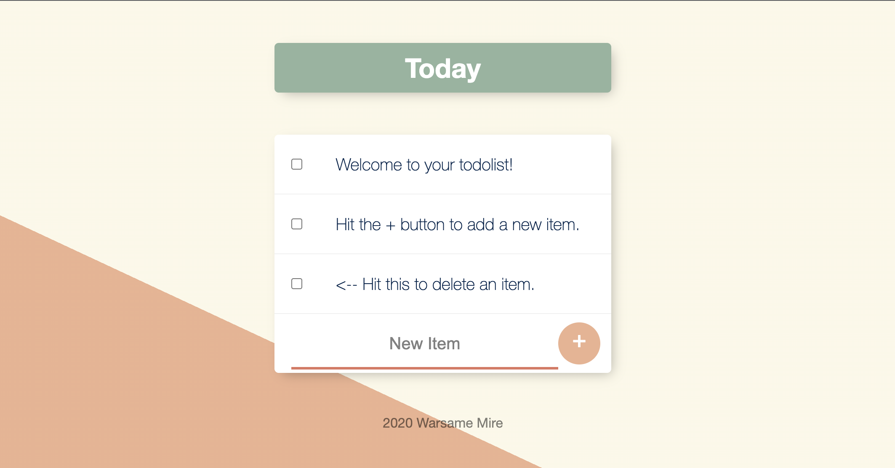

## To-Do List

This is a website that allows users to create a to-do list. You can add and delete new items and also create new lists for different occasions.

## Project Preview

## Installation and Setup Instructions

Clone down this repository. You will need `node` and `npm` installed globally on your machine.  

Installation:

`npm install`  

To Start Server:

`node app.js`  

To Visit App:

`localhost:3000`  

## Reflection

This project was created to showcase my knowledge with noSQL databases, It was also created to showcase my ability of making a application do CRUD(Create, Read, Update and Delete) operations.

I set out the build a web application that will allow a user to create a list of items they plan on achieving, I also set out to build the application in a way where the user would be able to delete items, create new list and have separate lists for different occasions.

The tools I used to build this project are HTML, CSS, Javascript, EJS, Node.js, Express.js, Mongoose, and MongoDB.

